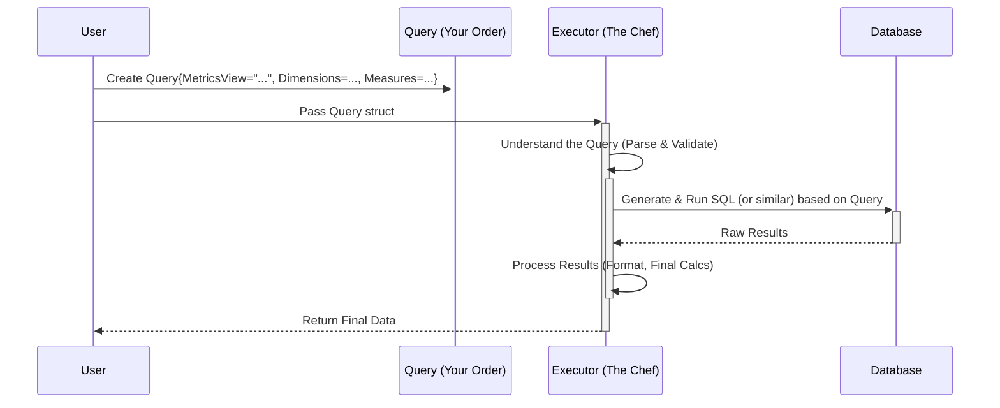

# Chapter 1: Query Definition (`Query` struct)

Welcome to the `metricsview` tutorial! If you've ever wanted to ask questions about your data – like "How many users visited my site yesterday?" or "What were the top-selling products last month?" – you're in the right place.

`metricsview` helps you get answers from your data models. But how do you tell `metricsview` *exactly* what you want to know? That's where the **Query Definition**, represented by the `Query` struct, comes in.

Think of it like ordering food at a restaurant. You don't just say "I want food." You give a specific order: "I'd like the grilled chicken sandwich (the data), sliced into two halves (dimensions), with extra pickles (filters), and please make it quick (sorting/limits)!"

The `Query` struct is your detailed order form for `metricsview`.

## What is the `Query` Struct?

The `Query` struct is a data structure (specifically, a `struct` in the Go programming language) that holds all the details of your request. It tells `metricsview`:

1.  **Which** data set (Metrics View) to query.
2.  **What** information (measures) you want to calculate (e.g., total sales, unique visitors).
3.  **How** to group the results (dimensions) (e.g., by country, by day).
4.  **When** the data should be from (time range).
5.  **Any special conditions** (filters) to apply (e.g., only show sales > $100, only include users from Canada).
6.  **How** to sort the results (e.g., highest sales first).
7.  **How many** results you want back (limit).
8.  ...and a few other advanced options.

Let's look at some key parts of the `Query` struct definition (simplified from `query.go`):

```go
// File: query.go (Simplified)

package metricsview

import "time"

// Query represents your request to metricsview
type Query struct {
	// Which metrics view definition to use
	MetricsView string

	// How to group the data (e.g., by 'country', 'product_category')
	Dimensions []Dimension

	// What calculations to perform (e.g., SUM(sales), COUNT(*))
	Measures []Measure

	// Filter data *before* grouping/calculating (like SQL WHERE)
	Where *Expression

	// Filter data *after* grouping/calculating (like SQL HAVING)
	Having *Expression

	// Define the time period for the query
	TimeRange *TimeRange

	// How to sort the final results
	Sort []Sort

	// Maximum number of rows to return
	Limit *int64

	// Other options...
	// ComparisonTimeRange *TimeRange
	// Offset              *int64
	// TimeZone            string
	// PivotOn             []string
	// ...
}

// Dimension specifies a grouping column
type Dimension struct {
	Name string // Name of the dimension (e.g., "country")
	// ... other advanced options
}

// Measure specifies a calculation
type Measure struct {
	Name string // Name of the measure (e.g., "total_sales")
	// ... other advanced options
}

// TimeRange specifies the time window for the query
type TimeRange struct {
	Start time.Time // Optional start time
	End   time.Time // Optional end time
	// Other ways to define time ranges (like "last 7 days")
	IsoDuration string
}

// Expression represents a filter condition (more on this later!)
type Expression struct {
	// Details of the condition (e.g., country = 'USA')
	// ... covered in Chapter 5
}

// Sort specifies how to order results
type Sort struct {
	Name string // Dimension or Measure name to sort by
	Desc bool   // True for descending (Z-A, 9-0), False for ascending (A-Z, 0-9)
}

```

*   **`MetricsView`**: The name of the pre-defined view of your data you want to query (like the menu you're ordering from).
*   **`Dimensions`**: These slice and dice your data. If you ask for `total_sales` (a measure) by `country` (a dimension), you'll get the total sales for *each* country.
*   **`Measures`**: These are the calculations you want, like sums, counts, averages. `total_sales` or `number_of_clicks`.
*   **`TimeRange`**: Filters your data to a specific time window, like "yesterday" or "the month of January".
*   **`Where`**: Filters the raw data *before* calculations happen. Example: Only include rows `WHERE device_type = 'mobile'`.
*   **`Having`**: Filters the results *after* calculations happen. Example: Only show countries `HAVING total_sales > 1000`.
*   **`Sort`**: Orders your final results. Example: Show countries sorted by `total_sales` descending (highest sales first).
*   **`Limit`**: Restricts the number of rows returned. Example: Only show the top 10 countries.

## A Simple Example: Ordering Your Data

Let's say we have a `MetricsView` called `"WebsiteAnalytics"` defined elsewhere. We want to ask:

> "What were the total pageviews (`total_views`) and unique visitors (`unique_visitors`) for each `country` yesterday?"

Here's how you might represent this request using the `Query` struct (conceptually):

```go
// This isn't runnable code yet, just shows the structure!
myQuery := Query{
    MetricsView: "WebsiteAnalytics", // Use the WebsiteAnalytics view

    Dimensions: []Dimension{ // Group by country
        {Name: "country"},
    },

    Measures: []Measure{ // Calculate these two things
        {Name: "total_views"},
        {Name: "unique_visitors"},
    },

    TimeRange: &TimeRange{ // For yesterday
        IsoDuration: "P1D", // P1D is standard code for "1 Day duration"
        // We'd also typically set an end date or offset,
        // or use specific Start/End times.
    },

    Sort: []Sort{ // Sort by unique visitors, highest first
        {Name: "unique_visitors", Desc: true},
    },

    Limit: int64Ptr(10), // Only give me the top 10 countries
}

// Helper function to get a pointer to an int64 (needed for Limit)
func int64Ptr(i int64) *int64 { return &i }
```

This `myQuery` object is now our "order form". It clearly specifies what we want (`total_views`, `unique_visitors`), how to group it (`country`), for when (`yesterday`), sorted (`unique_visitors` descending), and limited (`top 10`).

## How is the `Query` Used?

You create this `Query` object, filling in the details of your request. But the `Query` struct itself doesn't *do* anything – it's just data. It's the description of your request.

You need to hand this "order form" to the "chef" – the component responsible for actually fetching and calculating the data. In `metricsview`, this component is called the [Executor](02_executor_.md).

Here's a simplified flow:



1.  You (the User) create a `Query` struct instance.
2.  You pass this `Query` struct to the [Executor](02_executor_.md).
3.  The [Executor](02_executor_.md) reads your `Query`.
4.  *(Optional but important)*: Before proceeding, the Executor often checks if your query makes sense using [Validation](03_validation_.md). For example, the `Validate` function in `query.go` checks for incompatible combinations.
    ```go
    // File: query.go (Excerpt)
    func (q *Query) Validate() error {
        if q.Rows { // 'Rows' is a special mode to get raw data
            if len(q.Dimensions) > 0 {
                // You can't ask for raw rows AND specific dimension groupings
                return fmt.Errorf("dimensions not supported when rows is set...")
            }
            // ... other checks ...
        }
        return nil // Query looks okay!
    }
    ```
5.  The [Executor](02_executor_.md) translates your `Query` into a specific database query language (like SQL). This often involves creating an [Abstract Syntax Tree (AST)](04_abstract_syntax_tree__ast__.md) and potentially applying [Query Rewriting & Optimization](06_query_rewriting___optimization_.md).
6.  The Executor runs the database query.
7.  The Executor gets the results and sends them back to you.

## Conclusion

You've learned about the `Query` struct – the fundamental way to define your data requests in `metricsview`. It acts as a detailed specification, much like an order form, telling `metricsview` exactly what data you need, how to calculate it, how to group it, and how to filter or sort it.

This `Query` struct is the primary input you'll provide. But how does `metricsview` actually process this request and get the data? That's the job of the component we'll explore next.

Ready to meet the chef? Let's dive into the [Executor](02_executor_.md) in the next chapter!

---

Generated by [AI Codebase Knowledge Builder](https://github.com/The-Pocket/Tutorial-Codebase-Knowledge)