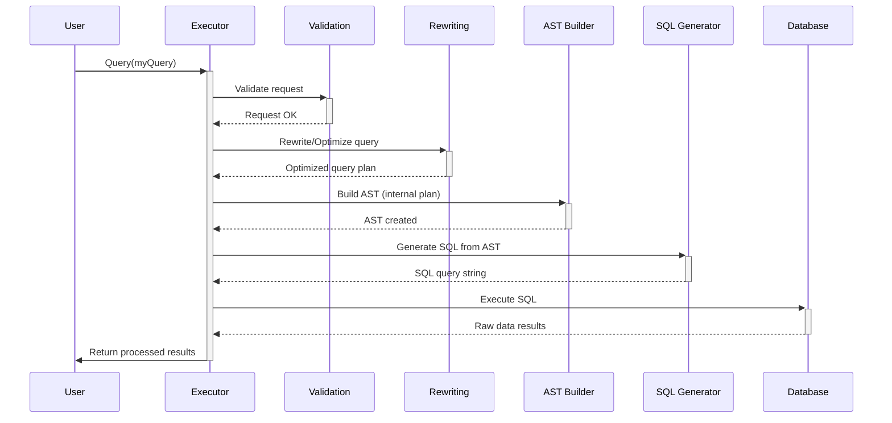

# Chapter 2: Executor

In [Chapter 1: Query Definition (`Query` struct)](01_query_definition___query__struct__.md), we learned how to create a detailed "order form" for the data we want using the `Query` struct. We specified what measures and dimensions we needed, the time range, filters, and sorting.

But just having the order form isn't enough. We need someone to take that order, understand it, prepare the "meal" (fetch the data), and bring it back to us. In `metricsview`, that crucial role is played by the **Executor**.

## What Does the Executor Do?

Think of the Executor as the **Project Manager** for your data request. When you hand it your `Query` struct (the project brief), the Executor takes charge and coordinates all the necessary steps to get you the final result.

Its main responsibilities include:

1.  **Receiving the Request**: It takes your `Query` struct as input.
2.  **Understanding and Checking**: It looks at your request and makes sure it's valid and makes sense. Does the requested dimension exist? Are the filters logical? This step often involves [Validation](03_validation_.md).
3.  **Planning the Work**: It figures out the best way to get the data. This might involve simplifying or changing your request slightly for better performance or correctness. This is done through [Query Rewriting & Optimization](06_query_rewriting___optimization_.md).
4.  **Creating a Blueprint**: It translates your request into an internal, structured plan called an [Abstract Syntax Tree (AST)](04_abstract_syntax_tree__ast__.md). This is like a detailed technical drawing for the final query.
5.  **Generating Instructions**: Based on the blueprint (AST), it generates the specific instructions (usually SQL code) needed to fetch the data from the database. It considers the specific database you're using, thanks to [Dialect Abstraction](07_dialect_abstraction_.md).
6.  **Executing the Plan**: It sends the generated SQL query to the OLAP (Online Analytical Processing) database.
7.  **Delivering the Results**: It receives the raw data from the database, potentially does some final processing, and returns the results to you.

Essentially, the Executor is the central brain orchestrating the entire process from your initial question to the final answer.

## How Do We Use the Executor?

You typically don't interact with the *internals* of the Executor directly, but you initiate its work. The process usually looks like this (conceptually):

1.  You create your `Query` struct (your order form).
2.  You obtain an `Executor` instance configured for your specific `MetricsView`.
3.  You call a method on the `Executor` (like `Query` or `Export`), passing it your `Query` struct.

Here's a simplified conceptual Go snippet showing how you might interact with it:

```go
package main

import (
	"context"
	"fmt"
	"metricsview" // Assuming metricsview package
	// ... other necessary imports
)

func main() {
	// 1. Define your request (from Chapter 1)
	myQuery := &metricsview.Query{
		MetricsView: "WebsiteAnalytics",
		Dimensions:  []metricsview.Dimension{{Name: "country"}},
		Measures:    []metricsview.Measure{{Name: "total_views"}},
		TimeRange:   &metricsview.TimeRange{IsoDuration: "P1D"}, // Yesterday
		Limit:       int64Ptr(10),
	}

	// --- Somewhere, you get an Executor instance ---
	// (This setup involves details about your metrics view,
	// database connection, etc., handled internally)
	ctx := context.Background()
	// Assume getExecutorForView handles finding the right metrics view,
	// connecting to the database, and setting up security.
	executor, err := getExecutorForView(ctx, "WebsiteAnalytics")
	if err != nil {
		fmt.Println("Error getting executor:", err)
		return
	}
	defer executor.Close() // Important: Release resources when done
	// --- ---

	// 3. Ask the Executor to run the query
	result, err := executor.Query(ctx, myQuery, nil) // Pass the query
	if err != nil {
		fmt.Println("Error executing query:", err)
		return
	}
	defer result.Close() // Important: Close the result set

	// 4. Process the results (simplified)
	fmt.Println("Query Results:")
	// Loop through result rows and print them (details omitted)
	// ... process result ...
}

// --- Helper functions (conceptual) ---

// Assume this function sets up and returns an Executor
func getExecutorForView(ctx context.Context, viewName string) (*metricsview.Executor, error) {
	// In a real app, this would involve:
	// - Getting the MetricsView definition (YAML/protobuf)
	// - Getting database connection details
	// - Applying security rules
	// - Calling metricsview.NewExecutor(...)
	fmt.Printf("Conceptual: Setting up executor for %s\n", viewName)
	// Placeholder: Replace with actual NewExecutor call and setup
	// return metricsview.NewExecutor(...)
	return &metricsview.Executor{}, nil // Dummy executor for example
}

// Helper for limit pointer
func int64Ptr(i int64) *int64 { return &i }

// Dummy Executor struct for the example to compile conceptually
namespace metricsview {
	type Executor struct{}
	func (e *Executor) Query(ctx context.Context, qry *Query, t *time.Time) (*Result, error) { return &Result{}, nil }
	func (e *Executor) Close() {}
	type Result struct{}
	func (r *Result) Close() {}
	// Include Query, Dimension, Measure, TimeRange structs from Chapter 1 here...
	type Query struct {
		MetricsView string
		Dimensions  []Dimension
		Measures    []Measure
		TimeRange   *TimeRange
		Limit       *int64
	}
	type Dimension struct{ Name string }
	type Measure struct{ Name string }
	type TimeRange struct{ IsoDuration string }
	type time struct{} // Dummy
} // end namespace metricsview
```

In this example:
*   We create our `myQuery`.
*   We obtain an `executor` instance (the setup details are hidden in `getExecutorForView` for simplicity).
*   We call `executor.Query(ctx, myQuery, nil)`. This is the core interaction – handing the order form to the project manager.
*   The `executor` does its magic behind the scenes.
*   We get back a `result` (or an `err` if something went wrong) and process it.

## What Happens Inside the Executor?

When you call a method like `Query`, the Executor kicks off a sequence of internal steps. Let's visualize this with a simplified diagram:



1.  **User Calls Executor**: You pass your `Query` struct.
2.  **Validation**: The Executor first checks the query using internal [Validation](03_validation_.md) logic (like `executor_validate.go`). Is the time range valid? Do the dimensions/measures exist?
3.  **Rewriting/Optimization**: The Executor might apply rules from [Query Rewriting & Optimization](06_query_rewriting___optimization_.md) to improve the query or handle special cases (like calculating percentages or dealing with database quirks).
4.  **AST Building**: It converts the (potentially rewritten) query into a structured [Abstract Syntax Tree (AST)](04_abstract_syntax_tree__ast__.md). This AST is a precise, internal representation of the query.
5.  **SQL Generation**: The Executor uses the AST and knowledge of the target database ([Dialect Abstraction](07_dialect_abstraction_.md)) to generate the final SQL query.
6.  **Database Execution**: The generated SQL is sent to the OLAP database via the appropriate driver (`drivers.OLAPStore`).
7.  **Return Results**: The database sends back raw data, which the Executor formats and returns to you as a `drivers.Result`.

## A Glimpse at the Code

The core logic resides in `executor.go`. Let's look at a very simplified `Executor` struct and the `Query` method:

```go
// File: executor.go (Highly Simplified)

package metricsview

import (
	"context"
	"time"
	// ... other imports
	runtimev1 "github.com/rilldata/rill/proto/gen/rill/runtime/v1"
	"github.com/rilldata/rill/runtime/drivers"
	"github.com/rilldata/rill/runtime" // For ResolvedSecurity
)

// Executor coordinates metrics view query execution.
type Executor struct {
	metricsView *runtimev1.MetricsViewSpec // Definition of the view
	olap        drivers.OLAPStore          // Connection to the database
	security    *runtime.ResolvedSecurity  // Security rules to apply
	// ... other fields like runtime, instanceID, priority etc.
	olapRelease func() // Function to release the DB connection
}

// NewExecutor creates a new Executor.
// (Simplified - actual function takes more parameters like runtime, instanceID, etc.)
func NewExecutor(/* ... params ... */) (*Executor, error) {
	// ... logic to get DB connection (olap), load metricsView, apply security ...
	// return &Executor{ olap: ..., metricsView: ..., security: ... }, nil
	panic("Simplified NewExecutor")
}

// Query executes the provided query.
// (Highly simplified sequence - actual method has many more steps)
func (e *Executor) Query(ctx context.Context, qry *Query, executionTime *time.Time) (*drivers.Result, error) {
	// 0. Check security - Can the user access this view/data?
	if !e.security.CanAccess() {
		return nil, runtime.ErrForbidden // Or similar error
	}

	// 1. Validate the basic query structure (See Chapter 3)
	err := qry.Validate() // Basic checks on the Query struct itself
	if err != nil {
		return nil, err
	}
	// Note: More comprehensive validation happens within the Executor too.

	// 2. Apply various rewrites (See Chapter 6)
	// Example: Handle time ranges, percentages, database-specific tweaks
	// err = e.rewriteQueryTimeRanges(ctx, qry, executionTime)
	// if err != nil { return nil, err }
	// err = e.rewritePercentOfTotals(ctx, qry)
	// if err != nil { return nil, err }
	// ... other rewrites ...

	// 3. Build the internal representation (See Chapter 4)
	ast, err := NewAST(e.metricsView, e.security, qry, e.olap.Dialect())
	if err != nil {
		return nil, err
	}

	// 4. Generate the final SQL (using AST and DB dialect - Chapter 7)
	sql, args, err := ast.SQL()
	if err != nil {
		return nil, err
	}

	// 5. Execute against the database
	res, err := e.olap.Query(ctx, &drivers.Statement{
		Query:    sql,
		Args:     args,
		Priority: e.priority, // Priority for query scheduling
		// ExecutionTimeout: ...,
	})
	if err != nil {
		return nil, err // Handle database errors
	}

	// 6. Return the result handle
	return res, nil
}

// Close releases the database connection.
func (e *Executor) Close() {
	if e.olapRelease != nil {
		e.olapRelease()
	}
}
```

*   The `Executor` struct holds necessary context like the `metricsView` definition, the `olap` database connection, and applied `security` rules.
*   The `Query` method demonstrates the high-level flow: check security, validate, apply rewrites, build the [AST](04_abstract_syntax_tree__ast__.md), generate SQL, execute via `e.olap.Query`, and return the `drivers.Result`.
*   `NewExecutor` (shown conceptually) is responsible for setting up the `Executor` with all its dependencies.
*   `Close` is important for releasing database resources.

Don't worry about understanding every detail of the code yet. The key takeaway is that the `Executor` orchestrates these distinct steps, calling upon other specialized components ([Validation](03_validation_.md), [Rewriting](06_query_rewriting___optimization_.md), [AST](04_abstract_syntax_tree__ast__.md), [Dialect](07_dialect_abstraction_.md)) along the way.

## Conclusion

You've now met the Executor, the central coordinator or "Project Manager" within `metricsview`. It takes your `Query` request, validates it, plans the execution (including optimizations and rewrites), generates the necessary database commands (like SQL), runs them, and delivers the results. It ensures that all the pieces work together smoothly to answer your data questions.

One of the very first steps the Executor takes is checking if your request is valid. How does it know if you're asking for something impossible or nonsensical? That's where our next topic comes in.

Let's move on to explore how `metricsview` ensures your requests make sense in [Chapter 3: Validation](03_validation_.md).

---

Generated by [AI Codebase Knowledge Builder](https://github.com/The-Pocket/Tutorial-Codebase-Knowledge)