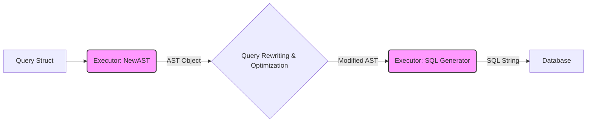
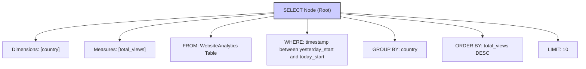
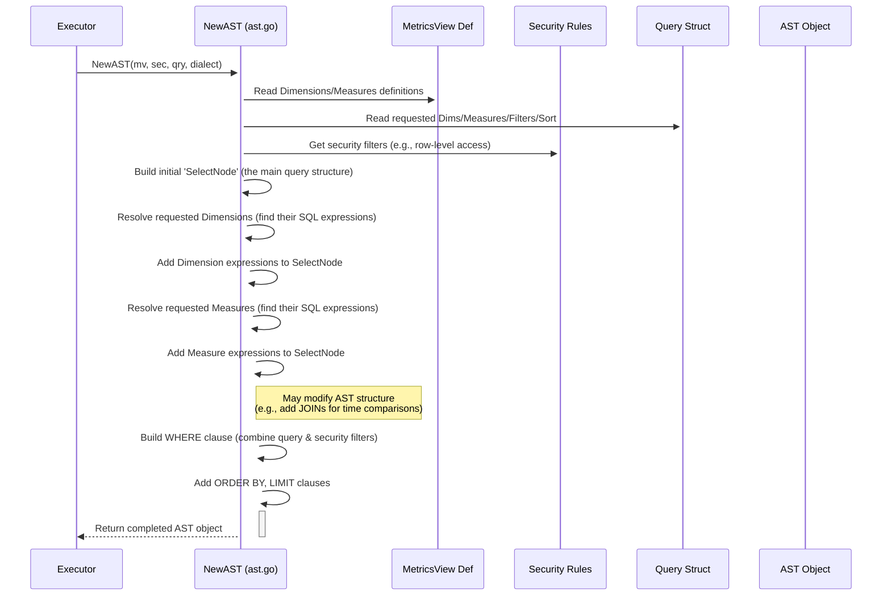

# Chapter 4: Abstract Syntax Tree (AST)

In the previous chapter, [Chapter 3: Validation](03_validation_.md), we learned how `metricsview` checks your request (the `Query` struct) to make sure it's sensible and follows the rules *before* doing any heavy lifting. It's like an inspector approving your building plans.

Okay, so your plan is approved! Now what? How does the [Executor](02_executor_.md) actually turn your request into something the database can understand, like SQL? Does it just start writing SQL strings directly?

Not quite! Trying to manipulate raw SQL strings directly is like trying to rearrange a finished wooden sculpture – it's difficult, messy, and easy to break. If we need to add a security filter, or change how a calculation works depending on the database, fiddling with SQL strings directly is a recipe for errors.

`metricsview` uses a much smarter approach: it first builds an **Abstract Syntax Tree (AST)**.

## What is an Abstract Syntax Tree (AST)?

Imagine you have a sentence: "The quick brown fox jumps over the lazy dog."

An AST is like diagramming this sentence, breaking it down into its grammatical parts (subject, verb, object, adjectives, etc.) and showing how they relate to each other in a tree structure.

For a SQL query, an AST does the same thing. It takes your `Query` request and breaks it down into its fundamental components:

*   What columns are you SELECTing? (Dimensions, Measures)
*   Where is the data coming FROM? (Table, maybe another sub-query)
*   How should the data be filtered? (WHERE clause)
*   How should the data be grouped? (GROUP BY clause)
*   How should results be ordered? (ORDER BY clause)
*   How many results? (LIMIT clause)

Instead of a flat string of text, the AST is a **structured, tree-like representation** of your query inside the computer's memory.

**The LEGO Analogy:**

Think of building something complex.

*   **Raw SQL String:** Like trying to carve your final design directly out of a single block of wood. It's hard to change things later without starting over or making mistakes.
*   **AST:** Like building with LEGO bricks. Each brick represents a part of your query (a dimension, a filter, a join). You can easily add new bricks, remove existing ones, or rearrange them *before* you decide the final design is complete.

This structured "LEGO" approach makes it much easier for `metricsview` to analyze, modify, and transform your query request during the process.

## How `metricsview` Uses the AST

The AST isn't something you usually create directly. It's an internal tool used by the [Executor](02_executor_.md). Here's the typical flow:

1.  **Input:** You provide your validated [Query Definition (`Query` struct)](01_query_definition___query__struct__.md) to the [Executor](02_executor_.md).
2.  **AST Construction:** The Executor calls an internal builder (specifically, the `NewAST` function in `ast.go`) to convert your `Query` struct into an AST object. This builder uses the details from your `Query`, the Metrics View definition, security rules, and information about the target database ([Dialect Abstraction](07_dialect_abstraction_.md)).
3.  **Transformation (Optional but Powerful):** Now that the query is in a structured AST format, `metricsview` can easily perform [Query Rewriting & Optimization](06_query_rewriting___optimization_.md). This might involve:
    *   Adding security filters automatically.
    *   Calculating percentages or time comparisons.
    *   Adjusting functions based on the specific database dialect.
4.  **SQL Generation:** Finally, the (potentially modified) AST is passed to a SQL generator. This component walks through the AST structure and translates it into the specific SQL dialect required by your database.
5.  **Execution:** The generated SQL is sent to the database.



The AST acts as this crucial intermediate step, enabling flexibility and advanced features.

## Example: From Query to AST (Conceptual)

Let's take a simple query from Chapter 1:

> "Get the `total_views` for each `country` yesterday, sorted highest first, limited to 10."

Your `Query` struct might look like this (simplified):

```go
myQuery := Query{
    MetricsView: "WebsiteAnalytics",
    Dimensions:  []Dimension{{Name: "country"}},
    Measures:    []Measure{{Name: "total_views"}},
    TimeRange:   &TimeRange{IsoDuration: "P1D"}, // Yesterday
    Sort:        []Sort{{Name: "total_views", Desc: true}},
    Limit:       int64Ptr(10),
}
```

Internally, `metricsview` would build an AST that represents this structure, something conceptually like:



This tree clearly separates the different parts of the query, making it easy for the system to understand and manipulate. For instance, adding a security filter would involve modifying the `WHERE` part of the tree. Generating SQL involves walking this tree and printing the corresponding SQL keywords and expressions.

## Internal Implementation: Building the Tree

How does the code actually build this tree? It happens primarily within the `NewAST` function in the `ast.go` file.

Here's a simplified sequence diagram showing the process when the [Executor](02_executor_.md) wants to create an AST:



The `NewAST` function acts like an architect, taking the blueprints (`Query`, Metrics View Definition, Security) and constructing the structured representation (the AST object).

## Code Glimpse: AST Structures (`ast.go`)

Let's peek at some *highly simplified* core structures from `ast.go` that define the AST:

```go
// File: ast.go (Simplified)

package metricsview

// AST is the abstract syntax tree for a metrics SQL query.
type AST struct {
	// Root of the AST (the main SELECT statement)
	Root *SelectNode
	// List of common table expressions (CTEs), if needed
	CTEs []*SelectNode

	// Contextual info used during building
	metricsView *runtimev1.MetricsViewSpec // Definition of the data
	security    *runtime.ResolvedSecurity  // Security rules
	query       *Query                     // The original user request
	dialect     drivers.Dialect            // Database type (Postgres, DuckDB, etc.)
	// ... other internal helpers
}

// SelectNode represents a query block (like SELECT ... FROM ... WHERE ...)
type SelectNode struct {
	Alias         string      // An internal name for this query block
	DimFields     []FieldNode // Dimensions to select (e.g., country)
	MeasureFields []FieldNode // Measures to calculate (e.g., SUM(views))
	FromTable     *string     // Base table to query (e.g., "WebsiteAnalytics")
	FromSelect    *SelectNode // Or, query from another SelectNode (subquery)
	// ... Joins (LeftJoinSelects, SpineSelect, JoinComparisonSelect) ...
	Where         *ExprNode   // WHERE clause conditions
	Group         bool        // Should this SELECT be grouped?
	Having        *ExprNode   // HAVING clause conditions
	OrderBy       []OrderFieldNode // How to sort
	Limit         *int64      // Max rows
	// ... other fields like Offset, Unnests
}

// FieldNode represents a column in a SELECT list (a dimension or measure)
type FieldNode struct {
	Name        string // The logical name (e.g., "country", "total_views")
	DisplayName string // How it should appear in results (optional)
	Expr        string // The SQL expression for this field (e.g., "country", "SUM(views)")
}

// ExprNode represents a filter expression (for WHERE or HAVING)
type ExprNode struct {
	Expr string // The SQL condition (e.g., "country = ?")
	Args []any  // Parameters for the condition (e.g., ["USA"])
}

// NewAST builds a new SQL AST based on a metrics query.
// (Highly simplified representation of the start of the function)
func NewAST(mv *runtimev1.MetricsViewSpec, sec *runtime.ResolvedSecurity, qry *Query, dialect drivers.Dialect) (*AST, error) {
	// Basic validation
	if len(qry.PivotOn) > 0 {
		return nil, errors.New("AST builder does not handle pivots directly")
	}

	// Initialize the AST structure
	ast := &AST{
		metricsView: mv,
		security:    sec,
		query:       qry,
		dialect:     dialect,
	}

	// 1. Resolve Dimensions from the query (find their SQL expressions)
	ast.dimFields = make([]FieldNode, 0, len(ast.query.Dimensions))
	for _, qd := range ast.query.Dimensions {
		// ... logic to find or build the SQL expression for dimension 'qd.Name' ...
		sqlExpr := ast.dialect.MetricsViewDimensionExpression(/*...dim details...*/)
		ast.dimFields = append(ast.dimFields, FieldNode{Name: qd.Name, Expr: sqlExpr})
	}

	// 2. Build the base WHERE clause (combining query filter and security filter)
	// ... logic using sqlForExpression (see Chapter 5) ...
	ast.underlyingWhere = /* combined filter expression */

	// 3. Build the main SelectNode (simplified)
	rootNode := &SelectNode{
		Alias:     "base", // Give it an internal name
		DimFields: ast.dimFields,
		FromTable: &mv.Table, // Point to the base table
		Where:     ast.underlyingWhere,
		Group:     len(ast.dimFields) > 0, // Group if dimensions are present
	}
	ast.Root = rootNode

	// 4. Add Measures (this can modify the AST, e.g., add joins)
	for _, qm := range ast.query.Measures {
		// ... logic to resolve measure 'qm.Name' and add it to ast.Root ...
		// This might call addSimpleMeasure, addDerivedMeasure, etc.
	}

	// 5. Add Sorting, Limits, etc.
	// ... logic to populate ast.Root.OrderBy, ast.Root.Limit ...

	return ast, nil
}

```

*   The `AST` struct holds the overall tree (`Root`, `CTEs`) and the context needed to build it.
*   The `SelectNode` is the workhorse, representing a `SELECT` query block with its parts. Notice how it can point to a `FromTable` or another `FromSelect` (allowing nested queries).
*   `FieldNode` represents one item in the `SELECT` list.
*   `ExprNode` represents filter conditions. We'll dive deeper into these in the next chapter.
*   The simplified `NewAST` function shows the high-level steps: initialize, resolve dimensions, build the `WHERE`, create the root `SelectNode`, add measures (which is complex), and add sorting/limits.

This structured approach allows `metricsview` to systematically build and modify the query representation before generating the final SQL.

## Conclusion

You've learned about the Abstract Syntax Tree (AST) – a crucial internal data structure in `metricsview`. It's like a structured blueprint or a LEGO model of your SQL query, built from your initial `Query` request.

The AST isn't raw SQL; it's a more flexible, tree-like format that makes it much easier for `metricsview` to:

*   Analyze the query structure.
*   Apply transformations like security filters or computed measures ([Query Rewriting & Optimization](06_query_rewriting___optimization_.md)).
*   Finally, generate the correct SQL code for different database backends ([Dialect Abstraction](07_dialect_abstraction_.md)).

We saw that filter conditions within the `Query` (like `Where` and `Having`) and within the AST itself are represented using `Expression` objects (`ExprNode` in the AST). How does `metricsview` handle these potentially complex conditions?

Let's find out in the next chapter: [Chapter 5: Expression Handling](05_expression_handling_.md).

---

Generated by [AI Codebase Knowledge Builder](https://github.com/The-Pocket/Tutorial-Codebase-Knowledge)