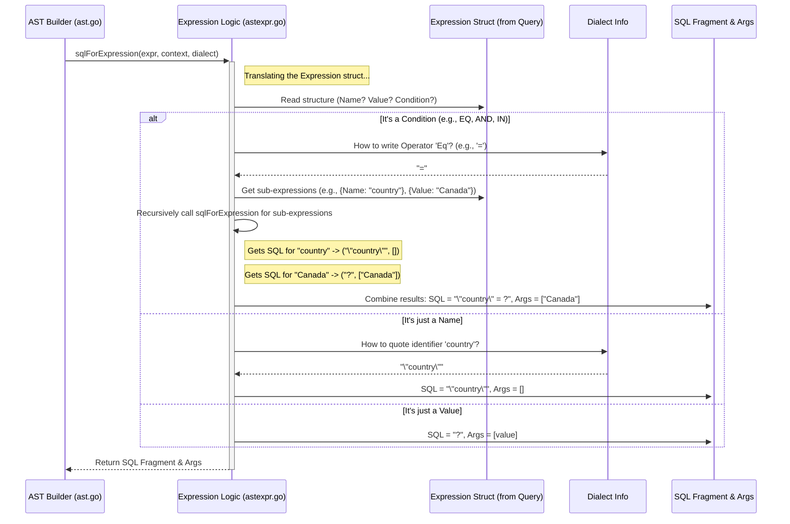

# Chapter 5: Expression Handling

In the previous chapter, [Chapter 4: Abstract Syntax Tree (AST)](04_abstract_syntax_tree__ast__.md), we saw how `metricsview` creates a structured, tree-like representation (the AST) of your data request. This AST has placeholders for different parts of a query, including filter conditions like `WHERE` and `HAVING`.

But how do we actually *tell* `metricsview` what those conditions should be? How do we say "only show data where the `country` is 'USA'" or "only include results where `total_sales` are greater than 1000"? And how does `metricsview` take that instruction and turn it into something the database understands, like a piece of SQL code?

This is where **Expression Handling** comes in.

## What Problem Does Expression Handling Solve?

Imagine you're talking to a translator who specializes in logical rules. You want to give them precise instructions for filtering information. You wouldn't just vaguely say "filter the data." You'd say something specific like:

*   "Keep only the records WHERE the `country` field is exactly 'Canada'."
*   "Also, make sure the `device_type` field is 'mobile'."
*   "Finally, AFTER you calculate the total sales per country, only show me the countries HAVING `total_sales` greater than 5000."

Expression Handling is `metricsview`'s way of understanding these specific filter instructions. It provides:

1.  **A Structured Way to Define Conditions:** A clear format (the `Expression` struct) for you to write down your filtering rules (like `country = 'Canada'`).
2.  **A Translator:** Logic (mainly in `astexpr.go`) that takes your structured rules and converts them into the specific SQL grammar needed for the `WHERE` or `HAVING` clauses in the final database query.

This translator needs to be smart enough to handle different kinds of conditions (equals, greater than, IN a list, LIKE a pattern, AND, OR) and also understand the slightly different ways various databases might express these conditions ([Dialect Abstraction](07_dialect_abstraction_.md)).

## Key Concepts: Building Blocks for Filters

The main building block for defining filters is the `Expression` struct we saw briefly in [Chapter 1: Query Definition (`Query` struct)](01_query_definition___query__struct__.md). Let's look closer.

**1. The `Expression` Struct**

This struct (defined in `query.go`) can represent different parts of a condition:

```go
// File: query.go (Simplified relevant parts)

// Expression represents a filter condition or part of one.
type Expression struct {
	// Option 1: Reference a dimension or measure name
	Name string `mapstructure:"name"` // e.g., "country", "total_sales"

	// Option 2: Represent a literal value
	Value any `mapstructure:"val"` // e.g., "USA", 1000, true

	// Option 3: Represent a logical condition (like AND, OR, EQ, GT)
	Condition *Condition `mapstructure:"cond"`

	// Option 4: Represent a subquery (more advanced, not covered here)
	Subquery *Subquery `mapstructure:"subquery"`
}
```

An `Expression` can be one of four things:
*   A **Name:** Refers to a column or measure (like `country`).
*   A **Value:** A specific value (like `'USA'` or `1000`).
*   A **Condition:** A logical operation (like `=`, `>`, `AND`, `OR`, `IN`) that combines other expressions. This is where the complexity lies.
*   A **Subquery:** A nested query used as part of the condition (advanced).

**Example: "country = 'USA'"**

To represent `country = 'USA'`, we'd use a `Condition`:

```go
// Conceptual Go code for the Expression

filter := Expression{
    Condition: &Condition{
        Operator: OperatorEq, // "Eq" means equals (=)
        Expressions: []*Expression{
            {Name: "country"}, // Left side: the dimension name
            {Value: "USA"},    // Right side: the literal value
        },
    },
}
```

**2. The `Condition` Struct**

The `Condition` struct is used inside an `Expression` when we need to define a logical operation:

```go
// File: query.go (Simplified relevant parts)

// Condition represents a logical operation within an Expression.
type Condition struct {
	// What operation to perform? (e.g., AND, OR, EQ, GT, LT, IN, LIKE)
	Operator Operator `mapstructure:"op"`

	// What expressions does this operator work on?
	Expressions []*Expression `mapstructure:"exprs"`
}

// Operator defines the type of comparison or logical connection.
type Operator string

const (
	OperatorEq    Operator = "eq"     // Equals (=)
	OperatorNeq   Operator = "neq"    // Not Equals (!=)
	OperatorLt    Operator = "lt"     // Less Than (<)
	OperatorLte   Operator = "lte"    // Less Than or Equal (<=)
	OperatorGt    Operator = "gt"     // Greater Than (>)
	OperatorGte   Operator = "gte"    // Greater Than or Equal (>=)
	OperatorIn    Operator = "in"     // Included in a list (IN)
	OperatorNin   Operator = "nin"    // Not Included in a list (NOT IN)
	OperatorIlike Operator = "ilike"  // Case-Insensitive LIKE (ILIKE)
	OperatorNilike Operator = "nilike" // Case-Insensitive NOT LIKE (NOT ILIKE)
	OperatorOr    Operator = "or"     // Logical OR
	OperatorAnd   Operator = "and"    // Logical AND
	// ... (OperatorUnspecified is also defined)
)
```

*   `Operator`: Tells us *what* comparison or combination to do (e.g., `OperatorEq` for `=`, `OperatorAnd` for `AND`).
*   `Expressions`: A list of other `Expression` structs that this operator applies to. For binary operators like `=`, `>`, `<`, there will be two expressions (left side, right side). For `AND` or `OR`, there can be two or more. For `IN`, the right side is typically a list of values.

**Example: "country = 'USA' AND device = 'mobile'"**

This requires nesting `AND` with two `EQ` conditions:

```go
// Conceptual Go code for the Expression

filter := Expression{
    Condition: &Condition{
        Operator: OperatorAnd, // Top level is AND
        Expressions: []*Expression{
            // First part: country = 'USA'
            {
                Condition: &Condition{
                    Operator: OperatorEq,
                    Expressions: []*Expression{
                        {Name: "country"},
                        {Value: "USA"},
                    },
                },
            },
            // Second part: device = 'mobile'
            {
                Condition: &Condition{
                    Operator: OperatorEq,
                    Expressions: []*Expression{
                        {Name: "device"},
                        {Value: "mobile"},
                    },
                },
            },
        },
    },
}
```

This structured way allows us to build arbitrarily complex filter logic.

## How to Use Expressions in Your Query

You define these `Expression` structures within the `Where` (filters raw data before aggregation) or `Having` (filters aggregated results) fields of your main `Query` struct from [Chapter 1: Query Definition (`Query` struct)](01_query_definition___query__struct__.md).

**Example 1: `WHERE country = 'Canada'`**

```go
myQuery := Query{
    // ... other fields like MetricsView, Dimensions, Measures ...
    Where: &Expression{ // Pointer to an Expression struct
        Condition: &Condition{
            Operator: OperatorEq,
            Expressions: []*Expression{
                {Name: "country"},
                {Value: "Canada"},
            },
        },
    },
    // ...
}
```

**Example 2: `HAVING total_sales > 1000`**

```go
myQuery := Query{
    // ... other fields like MetricsView, Dimensions, Measures ...
    Having: &Expression{ // Use the Having field
        Condition: &Condition{
            Operator: OperatorGt, // Greater Than (>)
            Expressions: []*Expression{
                {Name: "total_sales"}, // Assuming a measure named total_sales
                {Value: 1000},
            },
        },
    },
    // ...
}
```

**Example 3: `WHERE country = 'USA' AND device = 'mobile'` (As shown before)**

```go
myQuery := Query{
    // ... other fields ...
    Where: &Expression{
        Condition: &Condition{
            Operator: OperatorAnd,
            Expressions: []*Expression{
                { /* country = 'USA' condition */
                    Condition: &Condition{ Operator: OperatorEq, Expressions: []*Expression{{Name: "country"}, {Value: "USA"}}},
                },
                { /* device = 'mobile' condition */
                    Condition: &Condition{ Operator: OperatorEq, Expressions: []*Expression{{Name: "device"}, {Value: "mobile"}}},
                },
            },
        },
    },
    // ...
}
```

**Example 4: `WHERE city IN ('London', 'Paris')`**

```go
myQuery := Query{
    // ... other fields ...
    Where: &Expression{
        Condition: &Condition{
            Operator: OperatorIn,
            Expressions: []*Expression{
                {Name: "city"},
                // For IN, the second expression holds a list (slice) of values
                {Value: []any{"London", "Paris"}},
            },
        },
    },
    // ...
}
```

By constructing these `Expression` objects, you provide `metricsview` with the precise filtering logic you need.

## Internal Implementation: The Translator at Work

Okay, so you've created your `Query` with a nice `Expression` structure in the `Where` or `Having` field. How does that become SQL?

This translation happens when the [Executor](02_executor_.md) is building the [Abstract Syntax Tree (AST)](04_abstract_syntax_tree__ast__.md). It needs to figure out the SQL code for the `WHERE` and `HAVING` clauses of the AST. The logic for this translation lives primarily in `astexpr.go`.

Think of the `sqlForExpression` function inside `astexpr.go` as our specialist translator. It takes an `Expression` struct as input, looks at the database type ([Dialect Abstraction](07_dialect_abstraction_.md)), and outputs two things:
1.  A string containing the SQL fragment (e.g., `"country" = ?`, `total_sales > ?`, `"city" IN (?, ?)`).
2.  A list of the actual values to be safely inserted into the placeholders (`?`) (e.g., `["Canada"]`, `[1000]`, `["London", "Paris"]`). Using placeholders prevents SQL injection vulnerabilities.

Here's a simplified view of the process:



The `sqlForExpression` function recursively breaks down the `Expression` structure, translating each part into SQL according to the rules of the target database dialect.

**Code Glimpse (`astexpr.go`)**

Let's look at a *highly simplified* conceptual structure of the translation logic:

```go
// File: astexpr.go (Highly Simplified Concepts)

package metricsview

import (
	"fmt"
	"strings"
	// ... other imports
)

// sqlExprBuilder holds state during expression translation.
type sqlExprBuilder struct {
	ast     *AST             // Access to overall AST context (like dialect)
	out     *strings.Builder // Where the SQL string is built
	args    []any            // List of arguments for placeholders (?)
	dialect drivers.Dialect  // Database-specific rules
	// ... other context like current SelectNode, pseudoHaving, visible ...
}

// sqlForExpression is the main entry point (simplified).
func (ast *AST) sqlForExpression(e *Expression, /* ...context... */) (string, []any, error) {
	b := &sqlExprBuilder{
		ast:     ast,
		out:     &strings.Builder{},
		dialect: ast.dialect,
		// ... initialize context ...
	}

	err := b.writeExpression(e) // Start the recursive translation
	if err != nil {
		return "", nil, err
	}

	return b.out.String(), b.args, nil
}

// writeExpression handles one node of the Expression tree.
func (b *sqlExprBuilder) writeExpression(e *Expression) error {
	if e == nil { return nil }

	if e.Name != "" { // It's an identifier (dimension/measure name)
		// Lookup how to represent this name in SQL (e.g., "country" -> "\"country\"")
		sqlName, _, err := b.sqlForName(e.Name) // Uses dialect.EscapeIdentifier
		if err != nil { return err }
		b.out.WriteString(sqlName)
		return nil
	}

	if e.Value != nil { // It's a literal value
		b.out.WriteString("?") // Use a placeholder
		b.args = append(b.args, e.Value) // Add the value to the argument list
		return nil
	}

	if e.Condition != nil { // It's a logical condition (AND, OR, EQ, etc.)
		return b.writeCondition(e.Condition) // Handle the condition logic
	}

	// ... handle Subquery ...

	return fmt.Errorf("invalid expression")
}

// writeCondition handles logical operators.
func (b *sqlExprBuilder) writeCondition(cond *Condition) error {
	switch cond.Operator {
	case OperatorAnd: // Handle AND
		b.out.WriteString("(")
		for i, expr := range cond.Expressions {
			if i > 0 {
				b.out.WriteString(" AND ") // Add the AND keyword
			}
			// Recursively translate the inner expression
			err := b.writeExpression(expr)
			if err != nil { return err }
		}
		b.out.WriteString(")")
		return nil

	case OperatorEq: // Handle Equals (=)
        if len(cond.Expressions) != 2 { return fmt.Errorf("= needs 2 expressions") }
		b.out.WriteString("(")
        // Translate left side
		err := b.writeExpression(cond.Expressions[0])
		if err != nil { return err }

		// Handle special case: "IS NULL" instead of "= NULL"
        if hasNilValue(cond.Expressions[1]) {
            b.out.WriteString(" IS NULL")
        } else {
		    b.out.WriteString(" = ") // Add the = operator
            // Translate right side
		    err = b.writeExpression(cond.Expressions[1])
            if err != nil { return err }
        }
		b.out.WriteString(")")
		return nil

    case OperatorIlike: // Handle ILIKE (Case-insensitive LIKE)
        if len(cond.Expressions) != 2 { return fmt.Errorf("ILIKE needs 2 expressions") }
        b.out.WriteString("(")
        // Translate left side
		err := b.writeExpression(cond.Expressions[0])
        if err != nil { return err }

        // *** DIALECT SPECIFIC PART ***
        if b.dialect.SupportsILike() {
            b.out.WriteString(" ILIKE ")
        } else {
            // Fallback for databases without ILIKE
            b.out.WriteString(" LIKE LOWER(") // Wrap right side in LOWER
        }
        // ****************************

        // Translate right side
		err = b.writeExpression(cond.Expressions[1])
        if err != nil { return err }

        // *** DIALECT SPECIFIC PART ***
        if !b.dialect.SupportsILike() {
            b.out.WriteString(")") // Close LOWER parenthesis
        }
        // ****************************

        b.out.WriteString(")")
		return nil


	// ... handle other operators (OR, IN, GT, LT, etc.) ...

	default:
		return fmt.Errorf("unsupported operator: %s", cond.Operator)
	}
}

// hasNilValue checks if an expression represents a literal NULL value.
func hasNilValue(expr *Expression) bool {
	// Simplified check
	return expr != nil && expr.Value == nil && expr.Name == "" && expr.Condition == nil && expr.Subquery == nil
}

// sqlForName resolves a dimension/measure name to its SQL expression.
func (b *sqlExprBuilder) sqlForName(name string) (string, bool, error) {
    // ... logic to find the SQL expression for 'name' using b.ast.metricsView,
    // b.ast.security, b.dialect.EscapeIdentifier, etc. ...
	// This returns the SQL string, whether it requires unnesting, and any error.
	// Example: "country" -> "\"country\"", false, nil
	panic("Simplified sqlForName")
}

```

This simplified code illustrates:
*   The recursive nature of `writeExpression`.
*   How different parts (`Name`, `Value`, `Condition`) are handled.
*   How `Condition` logic handles specific operators like `AND`, `EQ`, and `ILIKE`.
*   How placeholders (`?`) and arguments (`b.args`) are used for safety.
*   **Crucially**, how it consults the `dialect` information (e.g., `b.dialect.SupportsILike()`) to generate database-specific SQL. This links directly to [Dialect Abstraction](07_dialect_abstraction_.md).

## Conclusion

Expression Handling is the "logic translator" within `metricsview`. It provides a structured way for you to define filter conditions (`WHERE`, `HAVING`) using the `Expression` and `Condition` structs in your `Query`.

Internally, `metricsview` uses sophisticated logic (like `sqlForExpression` in `astexpr.go`) to translate these structures into accurate and safe SQL fragments, respecting the specific grammar and capabilities of your target database ([Dialect Abstraction](07_dialect_abstraction_.md)). This translation happens during the creation of the [Abstract Syntax Tree (AST)](04_abstract_syntax_tree__ast__.md).

We now understand how a `Query` is defined, validated, turned into an AST, and how filter expressions within it are translated. But can `metricsview` modify the AST *after* it's built, perhaps to add features automatically or optimize the query?

Let's explore this next in [Chapter 6: Query Rewriting & Optimization](06_query_rewriting___optimization_.md).

---

Generated by [AI Codebase Knowledge Builder](https://github.com/The-Pocket/Tutorial-Codebase-Knowledge)