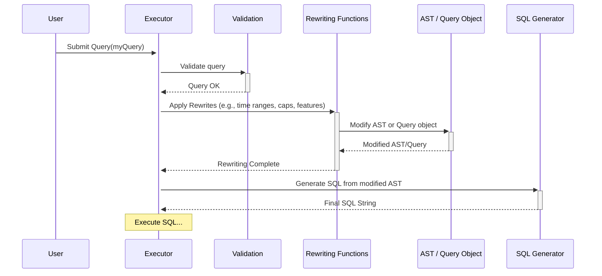

# Chapter 6: Query Rewriting & Optimization

In [Chapter 5: Expression Handling](05_expression_handling_.md), we saw how `metricsview` translates your filter conditions (like `WHERE country = 'USA'`) into SQL. And in [Chapter 4: Abstract Syntax Tree (AST)](04_abstract_syntax_tree__ast__.md), we learned that `metricsview` builds an internal, structured representation (the AST) of your query before generating SQL.

But is the initial query or the first version of the AST always the *best* or *most complete* way to get the answer? Sometimes, `metricsview` needs to refine or adjust the plan. This process is called **Query Rewriting & Optimization**.

## What is Query Rewriting & Optimization?

Imagine you write a first draft of an important email. Before sending it, you might review it. You might:

*   **Simplify long sentences:** Make it easier to read (Optimization for Performance).
*   **Fix typos or grammar:** Ensure it's correct (Correctness).
*   **Add missing context:** Include details needed for a specific feature (Feature Handling).
*   **Rephrase for the recipient:** Adjust the language for who you're sending it to (Dialect Specifics).
*   **Shorten it:** Make sure it fits within a certain length limit (Enforcing Limits).

Query Rewriting & Optimization in `metricsview` is very similar. It's a collection of steps, managed by the [Executor](02_executor_.md), that modify either your original [Query Definition (`Query` struct)](01_query_definition___query__struct__.md) or the internal [Abstract Syntax Tree (AST)](04_abstract_syntax_tree__ast__.md) *before* the final SQL is generated.

These changes aren't usually something you ask for directly; `metricsview` does them automatically behind the scenes to:

1.  **Improve Performance:** Make the query run faster (e.g., simplifying comparisons, pushing limits down into subqueries).
2.  **Ensure Correctness:** Adjust the query structure for the specific database being used (e.g., how Apache Druid handles grouping).
3.  **Handle Complex Features:** Add the necessary logic for features like percent-of-total calculations, time comparisons, or data pivoting.
4.  **Enforce System Limits:** Make sure the query doesn't ask for too much data (e.g., adding a maximum row limit).

Think of it as `metricsview` acting like an experienced editor, taking your request and polishing it into the best possible final version for the database.

## Examples of Rewrites

Let's look at a few common types of rewrites:

**1. Feature Handling: Calculating Percent-of-Total**

*   **Your Request:** "Show me the total sales per country, and also show each country's sales as a percentage of the overall total."
*   **The Problem:** Calculating the "overall total" requires a separate calculation (summing sales across *all* countries). Your initial query only asks for sales *per* country.
*   **The Rewrite:** `metricsview` recognizes you asked for a percentage. *Before* running the main query, it performs a *rewrite* step (`executor_rewrite_percent_of_totals.go`). This involves:
    1.  Running a *separate, temporary query* to get the overall total sales.
    2.  Storing that total value.
    3.  Modifying the main [Query Definition (`Query` struct)](01_query_definition___query__struct__.md) or the [Abstract Syntax Tree (AST)](04_abstract_syntax_tree__ast__.md) so that the final calculation `(country_sales / overall_total_sales) * 100` can be performed.

**2. Performance: Approximate Comparisons**

*   **Your Request:** "Show sales this month compared to last month for each product, sorted by this month's sales."
*   **The Problem:** Comparing time ranges often involves joining data from two different periods, which can be slow (a `FULL OUTER JOIN`).
*   **The Rewrite:** If configured (`MetricsApproximateComparisons`), `metricsview` might *rewrite* the query (`executor_rewrite_approx_comparisons.go`) to use a faster `LEFT JOIN` or `RIGHT JOIN`. This is an *approximation* – it might slightly miss some edge cases (like products that only existed last month but not this month), but it can be much faster for large datasets.

**3. Correctness/Dialect: Druid Grouping**

*   **Your Request:** "Show average session duration by country using Apache Druid."
*   **The Problem:** Druid sometimes requires specific query structures, especially with joins or complex measures, to ensure calculations are done correctly. It might need explicit `GROUP BY` clauses even when you might not expect them.
*   **The Rewrite:** `metricsview` detects it's talking to Druid. A rewrite step (`executor_rewrite_druid_groups.go`) modifies the [Abstract Syntax Tree (AST)](04_abstract_syntax_tree__ast__.md) to add the necessary `GROUP BY` clauses and potentially wrap measures in `ANY_VALUE` to satisfy Druid's requirements.

**4. Enforcing Limits: Row Caps**

*   **Your Request:** "Show me all users."
*   **The Problem:** "All users" could be millions or billions of rows, potentially overwhelming the database or the system.
*   **The Rewrite:** The administrator might have set a system-wide row limit (e.g., 1 million rows). A rewrite step (`executor_rewrite_enforce_caps.go`) checks your query's `Limit`. If you didn't specify one, or if you asked for more than the cap, it *modifies your query* to add or adjust the `Limit` clause to respect the system setting.

## How Does Rewriting Fit In?

Rewriting happens inside the [Executor](02_executor_.md), typically after initial [Validation](03_validation_.md) but *before* the final [Abstract Syntax Tree (AST)](04_abstract_syntax_tree__ast__.md) is turned into SQL.



1.  You submit your `Query`.
2.  The [Executor](02_executor_.md) validates it.
3.  The Executor calls a series of internal "Rewriting Functions". Each function checks if it needs to modify the query or AST based on the request, the database type, or system settings.
4.  These functions directly modify the `Query` struct or the internal `AST` object.
5.  Once all relevant rewrites are done, the potentially modified `AST` is passed to the SQL Generator.

## Code Glimpse: Rewriting in Action

Let's look at simplified examples of how these rewrites might appear in the code. Remember, you don't call these directly; the [Executor](02_executor_.md) does.

**Example 1: Enforcing Row Caps (Conceptual from `executor_rewrite_enforce_caps.go`)**

This function checks if a system limit (`limitCap`) exists and modifies the query's `Limit` field if needed.

```go
// File: executor_rewrite_enforce_caps.go (Simplified Concept)

// rewriteQueryEnforceCaps adjusts the query limit based on a system cap.
// qry is the user's Query struct.
// limitCap is the maximum rows allowed by the system (e.g., 1,000,000).
func rewriteQueryEnforceCaps(qry *Query, limitCap int64) (enforcedCap int64, err error) {
	// If there's no system cap, do nothing.
	if limitCap == 0 {
		return 0, nil
	}

	// If the user didn't specify a limit...
	if qry.Limit == nil {
		// ...set the query limit to one more than the cap.
		// (The result reader will check this later and error if needed).
		newLimit := limitCap + 1
		qry.Limit = &newLimit // Modify the query object!
		return limitCap, nil  // Tell the caller what cap was applied.
	}

	// If the user's limit is already over the cap...
	if *qry.Limit > limitCap {
		// ...return an error immediately. Don't even run the query.
		return 0, fmt.Errorf("query limit %d exceeds system cap %d", *qry.Limit, limitCap)
	}

	// User's limit is within the cap, so no changes needed.
	return 0, nil
}
```
*Self-Correction:* Need to clarify that this rewrite modifies the `Query` struct *before* the AST is built or finalized.

This rewrite function directly modifies the `qry.Limit` field within the [Query Definition (`Query` struct)](01_query_definition___query__struct__.md) itself, before the [Abstract Syntax Tree (AST)](04_abstract_syntax_tree__ast__.md) might even be fully constructed.

**Example 2: Druid Grouping (Conceptual from `executor_rewrite_druid_groups.go`)**

This function modifies the [Abstract Syntax Tree (AST)](04_abstract_syntax_tree__ast__.md) if the database is Druid and certain conditions (like joins) are met.

```go
// File: executor_rewrite_druid_groups.go (Simplified Concept)

// rewriteDruidGroups modifies the AST for Druid compatibility.
// ast is the Abstract Syntax Tree being built.
func rewriteDruidGroups(ast *AST) error {
	// Only apply this rewrite if the target database is Druid.
	if ast.dialect != drivers.DialectDruid {
		return nil // Not Druid, do nothing.
	}

	// Walk through the AST nodes (simplified logic here)
	// Assume 'node' is a SelectNode in the AST that needs modification
	// and 'needsRewrite' is true based on Druid rules (e.g., it has joins).
	var node *SelectNode = ast.Root // Start at the root
	var needsRewrite bool = (node.SpineSelect != nil) // Simplified condition

	if needsRewrite {
		// Modify the AST node:
		node.Group = true // Force GROUP BY clause generation

		// Wrap measures in ANY_VALUE aggregate function
		for i, field := range node.MeasureFields {
			field.Expr = fmt.Sprintf("ANY_VALUE(%s)", field.Expr) // Modify the SQL expression
			node.MeasureFields[i] = field // Update the node
		}
	}

	// (Real function recursively walks the whole AST tree)
	return nil
}
```

This rewrite directly manipulates the fields within the `SelectNode` of the [Abstract Syntax Tree (AST)](04_abstract_syntax_tree__ast__.md) (like setting `Group = true` and changing `MeasureFields[i].Expr`) to ensure the final SQL generated will work correctly on Druid.

**Example 3: Resolving Time Ranges (Conceptual from `executor_rewrite_time.go`)**

This function takes human-friendly time ranges (like "Last 7 Days") and converts them into specific start and end timestamps.

```go
// File: executor_rewrite_time.go (Simplified Concept)

// resolveTimeRange converts relative times to absolute start/end times.
// tr is the TimeRange struct from the user's query (e.g., {IsoDuration: "P7D"})
// tz is the timezone (e.g., time.UTC)
// executionTime is the current time, used as an anchor.
func resolveTimeRange(tr *TimeRange, tz *time.Location, executionTime *time.Time) error {
	if tr == nil || (tr.Start.IsZero() && tr.End.IsZero() && tr.IsoDuration == "" /* and others */) {
		return nil // Nothing to resolve
	}

	// --- Complex logic to calculate Start/End ---
	// If IsoDuration = "P7D" (7 days) and End is not set,
	// calculate End = executionTime, Start = executionTime - 7 days.
	// If Start is set and IsoDuration = "P1M" (1 month),
	// calculate End = Start + 1 month.
	// It uses libraries to handle durations and time zones correctly.
	// ... calculation logic ...
	calculatedStart := time.Now().Add(-7 * 24 * time.Hour) // Placeholder calculation
	calculatedEnd := time.Now()                           // Placeholder calculation

	// --- Update the TimeRange struct ---
	tr.Start = calculatedStart // Modify the object!
	tr.End = calculatedEnd     // Modify the object!

	// Clear the fields that are now replaced by Start/End
	tr.IsoDuration = ""
	tr.IsoOffset = ""
	tr.RoundToGrain = TimeGrainUnspecified
	tr.Expression = ""

	return nil
}

// Called by the Executor like this:
// err := resolveTimeRange(query.TimeRange, tz, execTime)
// err = resolveTimeRange(query.ComparisonTimeRange, tz, execTime)
```

This rewrite function modifies the `TimeRange` struct (which is part of the main [Query Definition (`Query` struct)](01_query_definition___query__struct__.md)) by filling in the `Start` and `End` fields and clearing the relative fields like `IsoDuration`. This ensures the rest of the system works with concrete time boundaries.

## Conclusion

Query Rewriting & Optimization is `metricsview`'s internal "editing" process. It takes the initial user request (the [Query Definition (`Query` struct)](01_query_definition___query__struct__.md)) or the intermediate plan (the [Abstract Syntax Tree (AST)](04_abstract_syntax_tree__ast__.md)) and refines it. These automatic adjustments are crucial for:

*   Implementing complex features (like time comparisons or percentages).
*   Improving query speed.
*   Ensuring correctness on different database systems.
*   Enforcing system-wide rules like row limits.

You don't typically interact with these rewrites directly, but they are essential for making `metricsview` powerful, efficient, and reliable.

Many of these rewrites, like the Druid grouping example or deciding how to handle `ILIKE` in [Chapter 5: Expression Handling](05_expression_handling_.md), depend heavily on the specific database being queried. How does `metricsview` manage these database-specific differences?

Let's find out in the final chapter: [Chapter 7: Dialect Abstraction](07_dialect_abstraction_.md).

---

Generated by [AI Codebase Knowledge Builder](https://github.com/The-Pocket/Tutorial-Codebase-Knowledge)