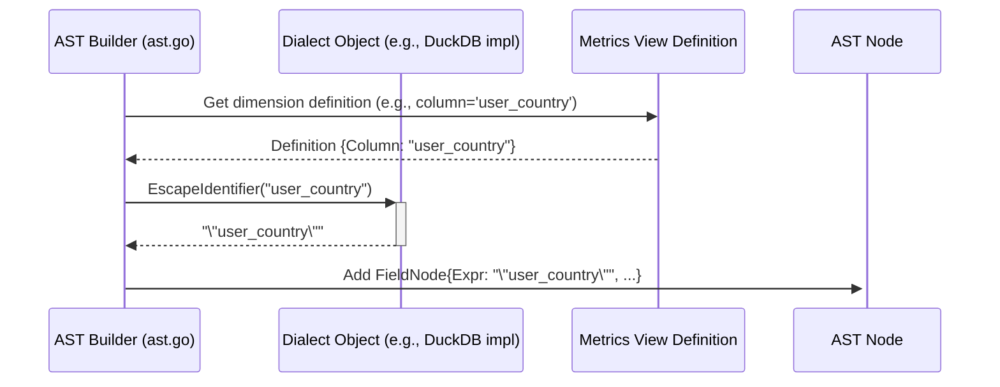

# Chapter 7: Dialect Abstraction

In [Chapter 6: Query Rewriting & Optimization](06_query_rewriting___optimization_.md), we saw how `metricsview` can automatically adjust your query plan for correctness or performance. We glimpsed an example where the rewrite logic needed to know if the database was Apache Druid (`executor_rewrite_druid_groups.go`). This hints at a bigger challenge: not all databases are the same!

Imagine you bought flat-pack furniture. The core pieces might be similar across different models, but the specific screws, tools, and assembly steps can vary. You need the *right* instruction manual for *your specific model* to build it correctly.

Similarly, databases like Druid, DuckDB, ClickHouse, and Pinot all understand SQL, but they speak slightly different "dialects". They might have unique functions, different ways to write common operations (like working with dates or quoting names), or specific performance quirks. How does `metricsview` handle this diversity and generate the *correct* "instructions" (SQL query) for the specific database it's talking to?

This is where **Dialect Abstraction** comes in.

## What is Dialect Abstraction?

Dialect Abstraction isn't a single piece of code you interact with directly. Instead, it's a **system-wide capability** built into `metricsview`. It allows the internal components, like the [Abstract Syntax Tree (AST)](04_abstract_syntax_tree__ast__.md) builder and the [Expression Handling](05_expression_handling_.md) logic, to adapt their behavior based on the target database.

Think of it as `metricsview` having a collection of database-specific "instruction manuals". When it needs to generate SQL, it consults the manual for the database you're using (e.g., the DuckDB manual, the Druid manual).

This system relies heavily on a Go interface called `drivers.Dialect`. An interface is like a contract that defines *what* methods must exist, but different database drivers provide their *own* implementations (their specific instruction manual).

## What's in the "Instruction Manual" (`drivers.Dialect`)?

The `drivers.Dialect` interface defines methods that tell `metricsview` how to generate specific pieces of SQL syntax or understand database capabilities. Here are some examples of what these "manuals" help with:

1.  **Quoting Names:** How should table or column names be wrapped?
    *   DuckDB/Postgres: Use double quotes (`"my_column"`).
    *   MySQL: Use backticks (`` `my_column` ``).
    *   SQL Server: Use square brackets (`[my_column]`).
    *   The `Dialect.EscapeIdentifier(name string) string` method handles this.

2.  **Date/Time Functions:** How do you truncate a timestamp to the nearest day?
    *   Postgres/DuckDB: `DATE_TRUNC('day', timestamp_column)`
    *   ClickHouse: `toStartOfDay(timestamp_column)`
    *   The `Dialect.DateTruncExpr(...)` method generates the correct syntax.

3.  **Specific Functions:** Does the database support a case-insensitive `LIKE` operation (often called `ILIKE`)?
    *   Postgres/DuckDB: Yes, they have `ILIKE`.
    *   ClickHouse: No, you need to use `lower(column) LIKE lower('pattern')`.
    *   The `Dialect.SupportsILike() bool` method tells the [Expression Handling](05_expression_handling_.md) logic which SQL to generate (as we saw conceptually in Chapter 5).

4.  **Rewrite Rules:** Some rewrite rules from [Chapter 6: Query Rewriting & Optimization](06_query_rewriting___optimization_.md) only apply to specific databases. The dialect information helps the [Executor](02_executor_.md) decide whether to run certain rewrites (like the Druid grouping rewrite).

5.  **JOIN Syntax:** Minor differences in how `JOIN` clauses are structured or what types of joins are optimally supported.

By consulting the appropriate `Dialect` implementation, `metricsview` ensures the generated SQL is valid and efficient for the target database.

## How is Dialect Abstraction Used?

You don't typically *choose* a dialect directly. When `metricsview` connects to your database, it identifies the database type and loads the corresponding `Dialect` implementation. This `Dialect` object is then passed around internally, primarily used by:

1.  **The [Executor](02_executor_.md):** To decide which rewrite rules to apply.
2.  **The [Abstract Syntax Tree (AST)](04_abstract_syntax_tree__ast__.md) Builder (`ast.go`):** To generate dialect-specific SQL expressions for dimensions, measures, and time functions when constructing the AST nodes.
3.  **[Expression Handling](05_expression_handling_.md) (`astexpr.go`):** To generate correct SQL for filter conditions (`WHERE`/`HAVING`), respecting function availability (like `ILIKE`) and identifier quoting.
4.  **SQL Generation (`astsql.go`):** To correctly format the final SQL string from the AST, including things like `ORDER BY` syntax or `LIMIT` clauses.

**Example: Expression Handling meets Dialect**

Let's revisit the simplified `ILIKE` example from [Chapter 5: Expression Handling](05_expression_handling_.md). Imagine the `astexpr.go` logic needs to generate SQL for `"country" ILIKE 'can%'`.

```go
// Simplified concept within astexpr.go's writeILikeCondition

// builder.dialect holds the specific Dialect object (e.g., DuckDB or ClickHouse)
dialect := builder.dialect

// Generate SQL for the left side (e.g., "country")
leftSQL, _ := builder.sqlForName("country") // Uses dialect.EscapeIdentifier internally!

// Generate SQL for the right side (e.g., "?", with args ['can%'])
rightSQL, rightArgs, _ := builder.sqlForValue("can%")

// *** Ask the Dialect! ***
if dialect.SupportsILike() {
    // DuckDB/Postgres path
    builder.out.WriteString(leftSQL + " ILIKE " + rightSQL)
} else {
    // ClickHouse path (or other DBs without ILIKE)
    builder.out.WriteString("lower(" + leftSQL + ") LIKE lower(" + rightSQL + ")")
}
builder.args = append(builder.args, rightArgs...)
```

This shows how the code explicitly calls `dialect.SupportsILike()` to decide which SQL syntax path to take. Other dialect methods like `EscapeIdentifier` are used implicitly when generating `leftSQL`.

## Internal Implementation: The `drivers.Dialect` Interface

The core is the `drivers.Dialect` interface (defined in `runtime/drivers/drivers.go`). It lists all the "questions" `metricsview` might need to ask about a database's specific dialect.

```go
// File: runtime/drivers/drivers.go (Highly Simplified Interface)

package drivers

// Dialect abstracts differences between SQL databases.
type Dialect interface {
	// Name returns the dialect's name (e.g., "duckdb", "druid").
	Name() string

	// EscapeIdentifier returns the dialect-specific quoted version of an identifier.
	EscapeIdentifier(name string) string

	// SupportsILike returns true if the dialect supports ILIKE operator.
	SupportsILike() bool

	// DateTruncExpr generates SQL for truncating a timestamp.
	DateTruncExpr(dimension *Dimension, grain runtimev1.TimeGrain, tz string, fdow, fmoy int) (string, error)

	// SQL Expression for joining columns
	JoinOnExpression(col1 string, col2 string) string

	// ... many other methods for specific functions, syntax, capabilities ...
	// CanPivot() bool
	// LateralUnnest(...) (string, bool, error)
	// SelectTimeRangeBins(...) (string, []any, error)
	// OrderByExpression(...) string
	// ... etc.
}
```

*   This interface defines the *contract*.
*   Specific database drivers (like `runtime/drivers/duckdb/duckdb.go`, `runtime/drivers/druid/druid.go`) provide concrete implementations that fulfill this contract.

**Example Implementations (Conceptual Snippets):**

Let's look at how `EscapeIdentifier` might differ:

```go
// File: runtime/drivers/duckdb/duckdb.go (Conceptual)

type duckDB struct{} // Implements drivers.Dialect

func (d *duckDB) Name() string { return "duckdb" }

func (d *duckDB) EscapeIdentifier(name string) string {
	// DuckDB uses standard SQL double quotes
	return fmt.Sprintf("%q", name) // Go's %q adds double quotes
}
// ... other duckdb methods ...
```

```go
// File: runtime/drivers/clickhouse/clickhouse.go (Conceptual)

type clickHouse struct{} // Implements drivers.Dialect

func (d *clickHouse) Name() string { return "clickhouse" }

func (d *clickHouse) EscapeIdentifier(name string) string {
	// ClickHouse often uses backticks
	return fmt.Sprintf("`%s`", name)
}
// ... other clickhouse methods ...
```

These tiny differences, defined in each driver's implementation of the `Dialect` interface, allow the rest of `metricsview` to generate correct SQL without needing lots of database-specific `if/else` statements scattered everywhere.

**Sequence Diagram: AST Builder using Dialect**

Here's how the [Abstract Syntax Tree (AST)](04_abstract_syntax_tree__ast__.md) builder might use the dialect when resolving a dimension:



1.  The AST Builder gets the column name (`user_country`) from the metrics view definition.
2.  It asks the `Dialect` object how to correctly quote this identifier for the target database.
3.  The `Dialect` returns the quoted version (e.g., `"user_country"` for DuckDB).
4.  The AST Builder uses this dialect-specific expression when creating the field node in the AST.

## Conclusion

You've reached the end of our core concepts tour! In this chapter, we explored **Dialect Abstraction**. This isn't one specific component but rather `metricsview`'s fundamental ability to adapt to different database backends (like DuckDB, Druid, ClickHouse).

Using the `drivers.Dialect` interface – our set of database-specific "instruction manuals" – `metricsview` can:

*   Generate SQL with the correct syntax for functions, identifiers, and clauses.
*   Understand the capabilities of the target database (e.g., does it support `ILIKE`?).
*   Enable or disable database-specific [Query Rewriting & Optimization](06_query_rewriting___optimization_.md) rules.

This abstraction ensures that your `metricsview` queries are translated accurately and efficiently, no matter which supported database holds your data. It's the key to `metricsview`'s flexibility in working across different data environments.

Thank you for following along through these chapters. We hope this gives you a solid foundation for understanding the core mechanics of `metricsview`!

---

Generated by [AI Codebase Knowledge Builder](https://github.com/The-Pocket/Tutorial-Codebase-Knowledge)