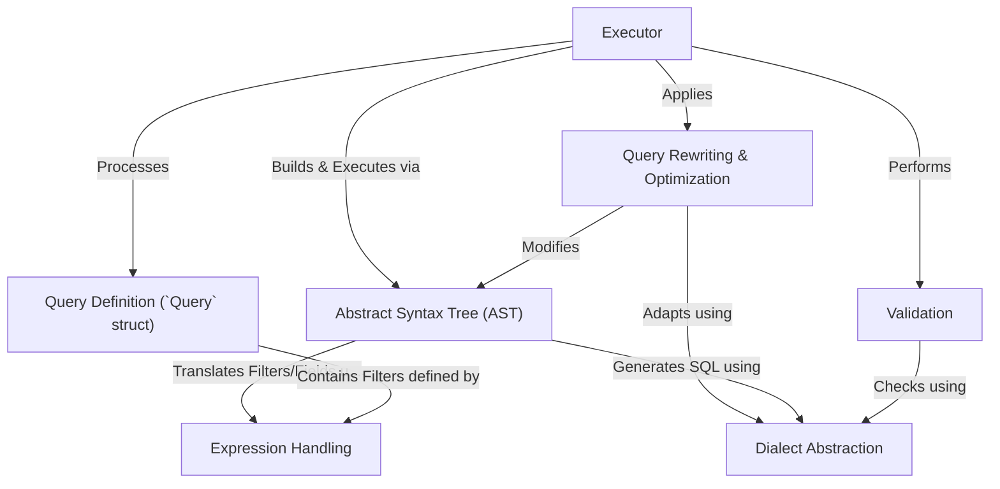

# Tutorial: metricsview

The `metricsview` project lets you define and query **metrics views** on top of your existing data warehouses (like Druid, DuckDB, ClickHouse).
It takes a structured *query definition* (specifying dimensions, measures, filters), validates it, optimizes it through various *rewrite steps*, builds an internal representation called an *Abstract Syntax Tree* (AST), and finally generates and executes SQL tailored to the specific database *dialect* to retrieve results or handle exports.

**Source Repository:** [None](None)

## Chapters

1. [Query Definition (`Query` struct)
](01_query_definition___query__struct__.md)
2. [Executor
](02_executor_.md)
3. [Validation
](03_validation_.md)
4. [Abstract Syntax Tree (AST)
](04_abstract_syntax_tree__ast__.md)
5. [Expression Handling
](05_expression_handling_.md)
6. [Query Rewriting & Optimization
](06_query_rewriting___optimization_.md)
7. [Dialect Abstraction
](07_dialect_abstraction_.md)

---

Generated by [AI Codebase Knowledge Builder](https://github.com/The-Pocket/Tutorial-Codebase-Knowledge)